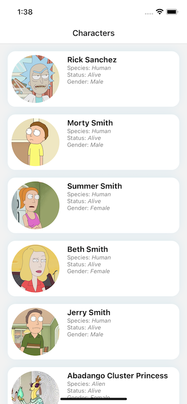
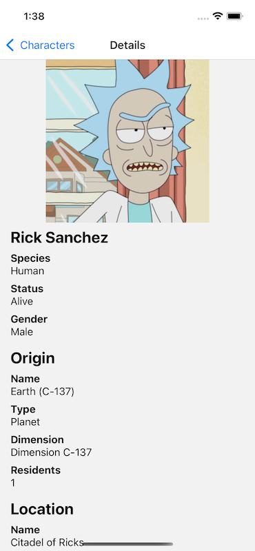

# ReactNativeRickAndMorty

Sample RN app displaying Rick and Morty characters

## Main screen

A paginated FlatList of characters with their avatar, name and some details.



## Details screen

A screen displaying the details of a character such as their status, gender, origin and last location, as well as a list of episodes in which the character appeared.


## How to run

Firstly you need to install the node dependencies with Yarn 3:

```bash
yarn install
```

Then you can run the app:

```bash
yarn ios
yarn android
```

this will also start the Metro bundler.

## Main libraries used

- [React Native](https://reactnative.dev/)
- [React Navigation](https://reactnavigation.org/)
- [Redux Toolkit](https://redux-toolkit.js.org/)
- [RTK Query](https://redux-toolkit.js.org/rtk-query/overview)
